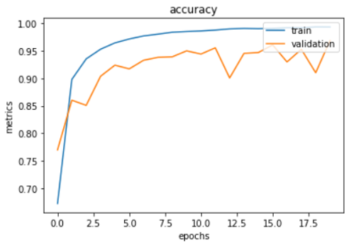

# Kaggle：Simpsons-Classification
使用的預訓練模型為ResNet50  
以Python撰寫  
> training：train.ipynb  
> testing：test.ipynb  

步驟
--
0.環境設定  
1.資料前處理  
2.模型建構  
3.效果評估  
4.改進  

## 0.環境設定  
    Anaconda + jupyter notebook(or VScode)
    Tensorflow-GPU = 2.6  
    cuDNN = 8.1  
    CUDA = 11.2  
    Keras = 2.6
    Pandas、Numpy、Matplotlib、scikit-learn等常用套件
    

## 1.資料前處理  

    #Data Augmentation
    #建立ImageDataGenerator
    datagen=tf.keras.preprocessing.image.ImageDataGenerator(
        rescale=1./255, #縮放到[0,1]
        horizontal_flip=True, #加入水平翻轉
        vertical_flip=True, #加入垂直翻轉
        rotation_range=30, #加入旋轉30度
        validation_split=0.2 #訓練集:驗證及=8:2
    )
    
    #設定圖片大小與batch大小
    batch_size = 32
    img_height = 180
    img_width = 180
    
    #使用flow_from_directory讀取資料集
    train_ds = datagen.flow_from_directory(
      data_dir, #資料集路徑
      subset="training", #訓練集
      seed=123, #隨機取樣
      target_size=(img_height, img_width),
      batch_size=batch_size)
      
    val_ds = datagen.flow_from_directory(
      data_dir,
      subset="validation", #驗證集
      seed=123,
      target_size=(img_height, img_width),
      batch_size=batch_size)

## 2.模型建構  

    def model_ResNet50():
    #載入預訓練模型_ResNet50
        base_model = ResNet50(weights='imagenet', #載入權重
                              include_top=False, #將最後輸出層移除
                              pooling=max, #設定為maxpooling
                              input_shape=(img_height,img_width,3))

        #transfer learning
        #只訓練最後輸出層，預訓練模型不做訓練，當作特徵提取器。
        #但此次資料集夠大，將不採用此方式。
        #for layer in base_model.layers: 
            #layer.trainable = False

        add_model = Sequential()
        add_model.add(base_model)
        add_model.add(GlobalAveragePooling2D()) #縮小輸入的維度
        #加入兩層，並使用L2正規化
        add_model.add(Dense(1024, kernel_regularizer=keras.regularizers.l2(0.001), activation='relu'))
        add_model.add(Dense(512, kernel_regularizer=keras.regularizers.l2(0.001), activation='relu'))
        #最後以softmax作為輸出分類。
        add_model.add(Dense(num_classes, activation='softmax')) #num_classes=50種

        model = add_model
        
        #設定optimizer與lossFunction
        optimizer='adam' 
        model.compile(
          optimizer=optimizer,
          loss=tf.losses.CategoricalCrossentropy(),
          metrics=['accuracy'])

        model.summary()
        return model
    
## 3.效果評估  

    #使用Accuracy與Loss 進行評估  
    #比較資料擴增 前後  
    #Accuracy of test：0.97 to 0.98  

未加入資料擴增  
  
  

加入資料擴增  
  
  
  
## 4.改進  

    拉長epoch，使模型訓練更多次。  
    嘗試使用其他預訓練模型。  
    最後輸出層改用SVM或RandomForest，作為分類器，預訓練模型只做為特徵提取。
    使用K-Fold或是bagging，訓練多個小模型，最後在使用Ensemble。
    
    
## 5.成果  

    Kaggle：Private Leaderboard (24/137)
 
   
